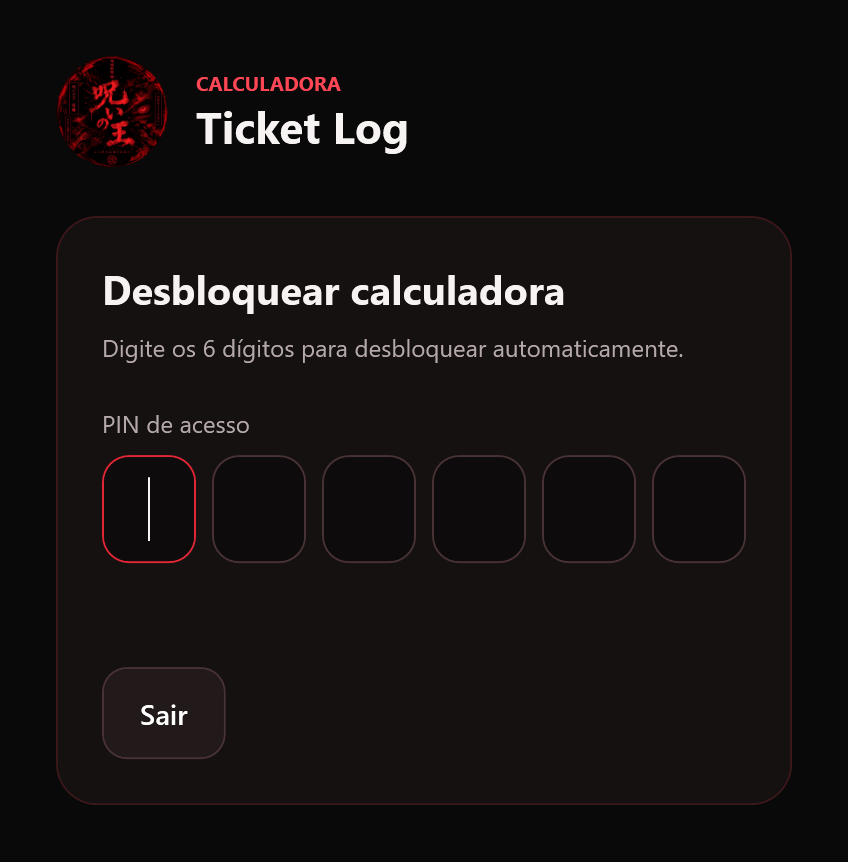
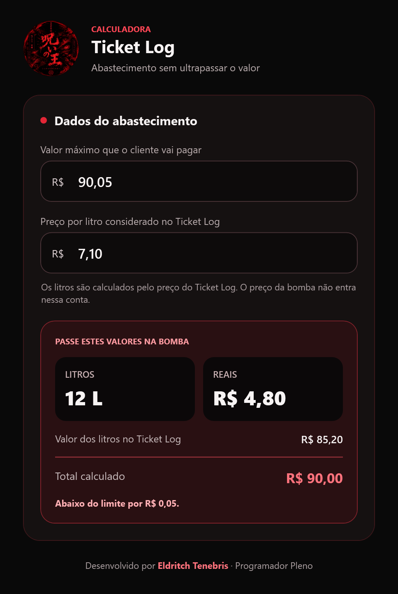

# ⛽ Ticket Log

Calculadora de abastecimento para Windows que ajuda a distribuir um valor máximo entre **litros inteiros e um complemento em reais**, usando o preço por litro considerado no Ticket Log.

Informe quanto o cliente pode pagar e o preço por litro. O app atualiza os resultados automaticamente e mostra o total estimado, respeitando o limite informado.

**Windows · C# · .NET 8 · WPF**

## ✨ Funcionalidades

- **Cálculo em tempo real:** os resultados mudam assim que você altera os valores, sem precisar clicar em um botão.
- **Litros inteiros:** calcula quantos litros completos cabem no orçamento.
- **Complemento em reais:** aproveita o saldo restante em múltiplos de R$ 0,10, arredondando para baixo.
- **Conferência do total:** exibe o custo dos litros, o complemento e uma mensagem indicando se o total atingiu o limite ou ficou abaixo dele.
- **Entrada no formato brasileiro:** aceita números com vírgula decimal, como `90,00` e `7,10`, e valida o texto digitado ou colado.
- **Acesso por PIN:** solicita seis dígitos ao abrir e desbloqueia automaticamente quando o PIN correto é preenchido.

Os cálculos são feitos localmente. **O preço usado é o do Ticket Log; o preço da bomba não entra nessa conta.** Confira as condições do benefício e os valores exibidos pela bomba antes de abastecer.

## 📸 Telas do aplicativo

Capturas da interface do app. Clique em uma imagem para vê-la em tamanho maior.

<table>
  <tr>
    <th>Acesso por PIN</th>
    <th>Calculadora de abastecimento</th>
  </tr>
  <tr>
    <td valign="top">
      <a href="./docs/images/tela-pin.png">
        
      </a>
    </td>
    <td valign="top">
      <a href="./docs/images/calculo-exato.png">
        
      </a>
    </td>
  </tr>
</table>

## Como usar

1. Abra o `TicketLog.exe` gerado na publicação.
2. Digite o PIN de seis dígitos para acessar a calculadora. Você também pode colar o PIN completo.
3. Em **Valor máximo que o cliente vai pagar**, informe o limite do abastecimento.
4. Em **Preço por litro considerado no Ticket Log**, informe o preço aplicável ao benefício.
5. Confira os campos **LITROS**, **REAIS** e **Total calculado**, além da mensagem sobre o limite.

Digite os valores sem `R$` e sem separador de milhar: por exemplo, `1500,00`. O preço por litro deve ser de pelo menos `0,01`. Campos vazios ou entradas inválidas deixam os resultados como `—` e exibem uma orientação.

## 🧮 Entendendo o cálculo

Com um limite de **R$ 90,00** e um preço de **R$ 7,10 por litro**, o resultado é:

| Campo | Resultado | O que significa |
| --- | --- | --- |
| LITROS | **12 L** | Quantidade de litros inteiros que cabe no limite. |
| Valor dos litros no Ticket Log | **R$ 85,20** | Custo dos 12 litros: `12 × R$ 7,10`. |
| REAIS | **R$ 4,80** | Complemento calculado a partir do saldo restante. |
| Total calculado | **R$ 90,00** | Soma do valor dos litros com o complemento. |

O campo **REAIS** é o complemento ao valor dos litros. Neste exemplo, a estimativa combina **12 litros + R$ 4,80**.

### Por que o total pode ficar abaixo do limite?

O complemento em reais é arredondado **para baixo, em múltiplos de R$ 0,10**. Se o limite for **R$ 90,05**, mantendo o preço de **R$ 7,10**, sobram R$ 4,85 após os 12 litros. O app usa R$ 4,80 como complemento e mostra:

> Abaixo do limite por R$ 0,05.

<details>
  <summary>Ver captura do cálculo com saldo restante</summary>

  <p>
    <a href="./docs/images/calculo-com-saldo.png">
      
    </a>
  </p>
</details>

A lógica está em [MainWindow.xaml.cs](./MainWindow.xaml.cs): os valores informados são convertidos para centavos, a quantidade de litros é calculada por divisão inteira e o complemento é obtido a partir do saldo disponível.

## 🛠️ Executar e compilar

### Requisitos

| Objetivo | Requisitos |
| --- | --- |
| Usar o executável autocontido | Windows 10 ou 11 (x64). Não exige instalação separada do .NET. |
| Compilar ou publicar | Windows e .NET 8 SDK. |
| Gerar os recursos de logo durante o build | PowerShell e `System.Drawing` do Windows. |

### Executar pelo código-fonte

Na pasta do projeto:

```powershell
dotnet build .\TicketLog.App.csproj --configuration Release
dotnet run --project .\TicketLog.App.csproj --configuration Release --no-build
```

### Publicar um executável independente

O comando abaixo gera um executável Windows x64 autocontido em `publish\TicketLog.exe`:

```powershell
dotnet publish .\TicketLog.App.csproj `
  --configuration Release `
  --runtime win-x64 `
  --self-contained true `
  --output .\publish `
  -p:PublishSingleFile=true `
  -p:IncludeNativeLibrariesForSelfExtract=true `
  -p:DebugType=None `
  -p:DebugSymbols=false
```

O executável publicado é um artefato de build e não deve ser enviado junto com o código-fonte. Para distribuir versões, publique-o como anexo de uma Release do GitHub.

### Sobre o PIN

A validação está implementada em [PinAccess.cs](./PinAccess.cs). Como o código-fonte é público e o PIN é validado localmente, essa tela não deve ser considerada uma proteção de segurança para dados ou operações sensíveis.

### Como alterar o PIN

Use o script [tools/Set-Pin.ps1](./tools/Set-Pin.ps1) para configurar seu próprio PIN de **seis dígitos**. Na pasta do projeto, execute no PowerShell:

```powershell
powershell.exe -NoProfile -ExecutionPolicy Bypass -File .\tools\Set-Pin.ps1
```

Digite o novo PIN e repita para confirmar. A digitação fica oculta. O script atualiza automaticamente `Salt` e `HashEsperado` em `PinAccess.cs`, usando PBKDF2-SHA256 e um novo salt aleatório. Apenas esses valores derivados são gravados no arquivo; o PIN em texto não é salvo.

Também é possível passar o PIN diretamente. Troque `001234` pelo valor desejado e mantenha as aspas para preservar zeros à esquerda:

```powershell
powershell.exe -NoProfile -ExecutionPolicy Bypass -File .\tools\Set-Pin.ps1 -Pin '001234'
```

Depois, recompile e execute o aplicativo para usar o novo PIN:

```powershell
dotnet build .\TicketLog.App.csproj --configuration Release
dotnet run --project .\TicketLog.App.csproj --configuration Release --no-build
```

Para atualizar `publish\TicketLog.exe`, execute novamente o comando da seção **Publicar um executável independente** e distribua o novo executável. As cópias geradas anteriormente continuam usando o PIN antigo.

### Integração contínua

O workflow [build.yml](./.github/workflows/build.yml) compila o projeto no Windows a cada push e pull request. Ele também pode ser executado manualmente pelo GitHub Actions.

## Licença

Distribuído sob a licença MIT. Consulte [LICENSE](./LICENSE).

## Marcas

Ticket Log é uma marca de terceiros. Este projeto independente não é afiliado, patrocinado ou endossado pelo titular da marca. Verifique as regras do seu benefício e os valores no momento do abastecimento.
